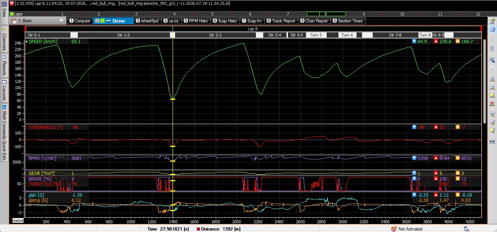

# High-Frequency Telemetry Data Analysis (Motorsport)

## Project Overview
This project focuses on extracting, preprocessing, and analyzing high-frequency physics and telemetry data from vehicle simulation environments (Assetto Corsa Competizione). The goal is to isolate vehicle dynamics and driver inputs to identify performance deltas and optimize track lap times using professional motorsport engineering software.

## Tech Stack & Tools
* **Data Source:** Assetto Corsa Competizione (Raw `.ld` physics logs)
* **Analysis Environment:** MoTeC i2 Pro
* **Data Points Analyzed:** Wheel speed, steering angle delta, engine RPM histograms, brake pressure modulation, and throttle application curves.

## Visual Data Proof

## Engineering Insights (Red Bull Ring - Porsche 992 GT3 R)
* Successfully captured and analyzed a baseline lap of **1:32.959**.
* Mapped precise braking spikes, visualizing the transition from 100% throttle to maximum brake pressure at critical corner entry points.
* Utilized sector-by-sector data mapping (Str 0-1, Str 1-2) to isolate micro-hesitations in throttle application, allowing for data-driven pace optimization
